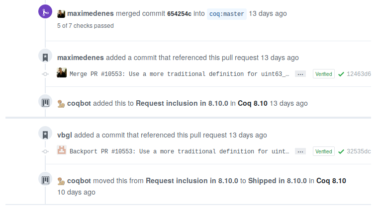
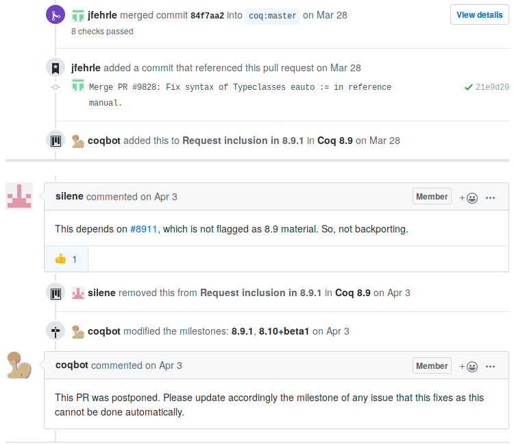

[![Zulip][zulip-badge]][zulip-link]

[zulip-badge]: https://img.shields.io/badge/chat-on%20Zulip-informational.svg
[zulip-link]: https://coq.zulipchat.com/#narrow/stream/243318-coqbot-devs.20.26.20users

# A multi-function bot, written in OCaml #

Most of the functions of this bot are used in the development of Coq.
A subset of functions (most notably the ability to synchronize GitHub
pull requests to GitLab branches and report back the results of
continuous integration) are used in a handful of additional projects.

This is a work in progress and your help is welcome, both in the form
of issues and pull requests.  When reporting a bug or requesting a
feature, please be as specific as possible, and be ready to follow up.
If you are not ready to follow up to make your needs more explicit, or
to help with testing, don't bother requesting a new feature in the
first place.

## Features ##

### Synchronization between GitHub and GitLab ###

GitLab is not just a development platform similar to GitHub, it is
also one of the best CI providers there is today.  Consequently, it is
no surprise that many projects that are developed on GitHub want to
use GitLab for CI/CD.  Since 2018, [GitLab CI/CD supports
GitHub][gitlab-github-support], but this only means mirroring the
repository's branches and reporting status checks back.  Pull requests
originating from forks get no testing, even though this has been a
[feature request][gitlab-fork-issue] for more than a year.

[gitlab-github-support]: https://about.gitlab.com/solutions/github/
[gitlab-fork-issue]: https://gitlab.com/gitlab-org/gitlab-ee/issues/5667

This bot works around this issue by pushing new and updated pull
requests to branches on the GitLab mirror.  Note that depending on
your settings this could result in a security risk.  In particular, if
you have secret variables, you should restrict them to protected
branches.  Otherwise, anyone could instrument pull request testing to
get access to their values.


When a pull request is not up-to-date with respect to its base branch,
the bot will create a merge commit and push this commit to GitLab so
that what is tested is the result of merging the PR (similar to what
Travis would test).  If the automatic merge fails, then the bot will
push a failed status check on the PR, and set a "needs: rebase" label
(it also removes the label when an updated version without conflicts
is pushed).


In the reverse direction, the bot will substitute itself to the status
check reporting that GitLab supports, and report more detailed
information on failing pipelines (with a direct link to the failed
job).


Using the status check reporting provided by this bot rather than the
one provided by GitLab is essential, because in the case of automatic
merge commits, GitLab wouldn't know how to report the status back.

The bot will delete branches corresponding to pull requests when the
pull requests are merged or closed.


Finally, the bot handles some cases of spurious failures by
relaunching the failed job automatically, for instance in case of
runner failure.  At some point in the past, shared runner failures
were very frequent and this feature was absolutely necessary to make
GitLab CI/CD usable in practice.  Nowadays, it would seem that this
has gotten better and the feature could be reconsidered.

Please open an issue if you would like any of the behaviors described
above to be configurable.

### Clear milestone of unmerged pull requests ###

When a pull request is closed without being merged, the bot will
remove any milestone that had been set.


Please open an issue if you would like this behavior to be
configurable.

### Synchronize closed issue's milestone with the one of the pull request that closed it ###

If an issue is closed automatically when merging a pull request, and
this pull request had a milestone set, then the bot will add the issue
to the same milestone.  If the issue was already in a different
milestone, the bot will change the milestone and post a comment
alerting of the change.


This feature won't be activated if you don't select the "issue" event
when configuring the GitHub webhook.

### Post comment when a pull request does not respect certain standards ###

This feature is only activated on the Coq repository.  Please open an
issue if you would like to use it on your repository too.

When someone opens a pull request but the name of the branch that was
used to open the pull request is the same as the base branch, the bot
posts a comment recommending to do differently next time, and suggests
reading the contributing guide.


### Manage the backporting process ###

This is a complex feature that is not activated by default, and that
would deserve a whole document to present it.  Please open an issue if
you are interested in hearing about it.





## How to use the **@coqbot** instance ##

To use the bot without deploying your own instance, follow these steps:

- Create a repository on GitLab.com whose URL is *exactly* the same as
  the one on GitHub except for the "lab" replacing the "hub" part.

  The bot will only take care of mirroring the PRs and reporting
  status checks back so you may still want to activate the mirroring
  feature for the main branches.  To do so, the easiest way is to
  choose the "CI/CD for external repo" option when creating the GitLab
  repository.  However, you should opt to give the repo by URL rather
  than with the GitHub button, because we won't need GitLab's own
  status check reporting feature. (If it is already activated, you can
  disable this integration in the "Settings" / "Integration" menu).

- In your GitLab repository:

  - go to "Members" to add
    [**@coqbot**](https://gitlab.com/coqbot) as a project member with
    "Developer" role (so that it can push new branches).

  - go to "Settings" / "Webhooks" and create two webhooks: one with
    URL <https://coqbot.herokuapp.com/pipeline> that will only be
    triggered by pipeline events, and one with URL
    <https://coqbot.herokuapp.com/job> that will only be triggered by
    job events.

- In your GitHub repository:

  - go to "Settings" / "Manage access" to add
    [**@coqbot**](https://github.com/coqbot) as a collaborator with
    the "Write" role (so that it can push status checks, and set
    labels).

    Currently every invitation requires a manual validation, so there
    may be some lag before **@coqbot** is able to push status checks
    to your repository.

  - go to "Settings" / "Webhooks" and add one webhook with URL
    <https://coqbot.herokuapp.com/github> that will only be triggered
    at least by pull request events, and if you want to use the issue
    milestone feature, by issue events as well.  Make sure you change
    the "content/type" value to "application/json".

## Architecture ##

The bot has grown according to the needs for automation in the Coq
project, initially as a single file, and is now incrementally being
rearchitectured around the idea of providing a library of base bot
components that can be used in a trigger-action programming model.

The most popular trigger-action programming platforms as of today are
IFTTT and Zapier.  Interestingly both of them provide a GitHub
integration, and Zapier provides a GitLab integration as well, but
their integrations do not include sufficiently advanced triggers nor
actions to perform the kind of things that this bot does.

The bot components are of three types (the naming follows [GraphQL's
terminology][graphql-terms] of the corresponding GraphQL requests,
GraphQL requests are preferred to REST requests whenever possible):

- **Subscriptions** are the events that the bot listens to (currently
  GitHub and GitLab webhooks).  See for instance
  `bot-components/GitHub_subscriptions.ml`.

- **Queries** are the requests that are sent to gather additional
  necessary information, and to decide whether the conditions to
  perform an action are met.  See for instance
  `bot-components/GitHub_queries.ml`.

- **Mutations** are the state-changing actions that are performed by
  the bot, in response to some event and some conditions being met.
  See for instance `bot-components/GitHub_mutations.ml`.

[graphql-terms]: https://graphql.github.io/graphql-spec/June2018/#sec-Language.Operations

When this architecture is sufficiently stable, the goal is to publish
the `bot-components` folder as an independent library of building
blocks to create a personalized bot in OCaml.  In the meantime, if you
deploy your own instance, the `callback` function in the `bot.ml` file
is the main entry point, where you can decide of your own business
logic by choosing the subscriptions you listen to, and by triggering
the relevant queries and mutations on demand.

## How to deploy a new instance ##

We provide a Docker image at each release, which can be easily deployed
to [Heroku](https://www.heroku.com/). Simply follow the official
[instructions](https://devcenter.heroku.com/articles/container-registry-and-runtime).

The bot will need to read a few environment variables so make sure
these are configured in your Heroku app:

- `GITLAB_ACCESS_TOKEN`
- `GITHUB_ACCESS_TOKEN`
- `GITHUB_WEBHOOK_SECRET`
- `BOT_NAME` (defaults to `coqbot`)
- `BOT_EMAIL` (defaults to `BOT_NAME@users.noreply.github.com`)

In the next release of coqbot, the `BOT_NAME` and `BOT_EMAIL`
environment variables won't have any effect and should be instead
set from a configuration file (see [`coqbot.toml`](coqbot.toml)).
The port number must not be set in the configuration file if you're
deploying the docker image to Heroku, since it uses a custom
environment variable.

A Dockerfile to build a personalized image based on a release image
from GitHub packages, using a custom `bot_config.toml` configuration
file would look like:
```dockerfile
FROM docker.pkg.github.com/coq/bot/coqbot:xxx

COPY bot_config.toml ./

EXPOSE 8000 # The port you specified in bot_config.toml (this command is ignored if you deploy to Heroku)

CMD ["./bot.exe", "bot_config.toml"]
```
Keep in mind that you should login first with your GitHub credentials
to GitHub packages.

## Building locally ##

Instructions for building and testing locally can be found in the
[contributing guide](.github/CONTRIBUTING.md).
